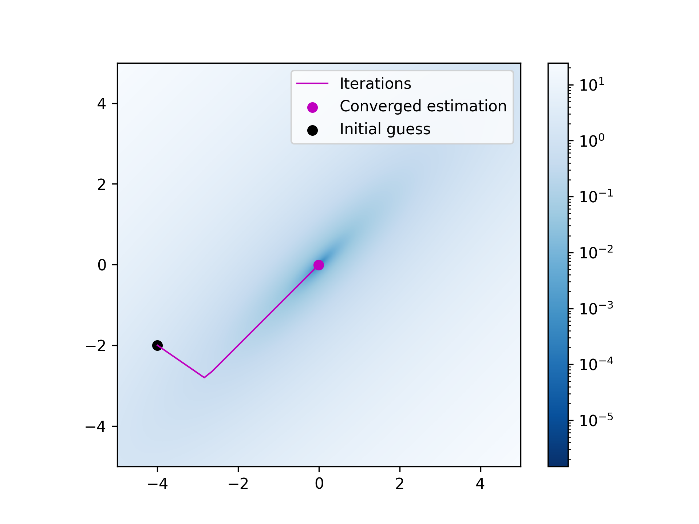

# ME455 Active Learning for Robotics Homework 4
**Author**: Jingkun (Allen) Liu

## Problem 1
**Find**: $a_z(t), b_v(t), M, m_1, m_2$

From the description, the $a_x(t)$, $b_u(t)$ and $p_1$ are:
$$
\begin{aligned}
    a_x(t) &= D_1 l(x(t), u(t))\\
    b_u(t) &= D_2 l(x(t), u(t))\\
    p_1 &= Dm(x(T))
\end{aligned}
$$

From equation $(7)$, we can derive that
$$
\begin{aligned}
    &\int_0^T \left[D_1 l(x(t), u(t)) \cdot z(t) + D_2 l(x(t), u(t)) \cdot v(t) \right] dt + Dm(x(T)) \cdot z(T) \\
    +& \int_0^T \left[z(t)^\top Q_z z(t) + v(t)^\top R_v v(t) \right] dt \\
    =& \int_0^T \left\{ \left[ a_x(t) + z(t)^\top Q_z\right] \cdot z(t) + \left[b_u(t) + v(t)^\top R_v\right] \cdot v(t)\right\} dt + p_1 \cdot z(T) \\
    =&  \int_0^T \left[ D_1 l'(z(t), v(t))  \cdot z(t) + D_2 l'(z(t), v(t)) \cdot v(t) \right] dt + p_1 \cdot z(T) \\
    =& \int_0^T \left[ a_z(t) \cdot z(t) + b_v(t) \cdot v(t) \right] dt + p_1 \cdot z(T)
\end{aligned}
$$

Hence, the expression for $a_z(t)$ and $b_v(t)$ are
$$
\begin{aligned}
    a_z(t) &= a_x(t) + z(t) ^\top Q_z \\
    &= D_1 l(x(t), u(t)) + z(t) ^\top Q_z \\
    b_v(t) &= b_u(t) + v(t) ^\top R_v \\
    &=  D_2 l(x(t), u(t)) + v(t) ^\top R_v
\end{aligned}
$$

Then, since we know that 
$$
\begin{aligned}
    0 &=p(t)^\top B(t) + b_v(t) ^\top \\
    b_v(t) &= b_u(t) + v(t) ^\top R_v
\end{aligned}
$$

We can find the expression for $v(t)$ by
$$
\begin{aligned}
    0 &= p(t) ^\top B(t) + \left[b_u(t) + v(t)^\top R_v\right] ^\top \\
    &= p(t) ^\top B(t) + b_u(t) ^\top + R_v^\top v(t) \\
    R_v^\top v(t) &= -p(t)^\top B(t) - b_u(t) ^\top \\
    v(t) &= -R_v^{-\top}p(t)^\top B(t) - R_v^{-\top}b_u(t)^\top
\end{aligned}
$$

Then since the ODE is expressed as:
$$
\begin{aligned}
    \dot{p}(t) &= -A(t)^\top p(t) - a_z(t) \\
    \dot{z}(t) &= A(t) z(t) + B(t) v(t)
\end{aligned}
$$

The ODE can be expressed in matrix form as:
$$
\begin{aligned}
    \begin{bmatrix}
        \dot{z}(t) \\ \dot{p}(t)
    \end{bmatrix} &= \begin{bmatrix}
        A(t) & 0 \\
        0 & -A(t)^\top
    \end{bmatrix} \begin{bmatrix}
        z(t) \\ p(t)
    \end{bmatrix} + \begin{bmatrix}
        -a_z(t) \\ B(t)v(t)
    \end{bmatrix} \\
    &= \begin{bmatrix}
        M_{11} & M_{12} \\
        M_{21} & M_{22} 
    \end{bmatrix} \begin{bmatrix}
        z(t) \\ p(t)
    \end{bmatrix} + \begin{bmatrix}
        m_1 \\ m_2
    \end{bmatrix}
\end{aligned}
$$

Finally the $M$ matrix and vector $m_1, m_2$ can be expressed as:
$$
\begin{aligned}
    M &= \begin{bmatrix}
        A(t) & 0 \\
        0 & -A(t)^\top 
    \end{bmatrix} \\
    m_1 &= -a_z(t) \\
    m_2 &= B(t)v(t) \\
    &= B(t) \left[-R_v^{-\top}p(t)^\top B(t) - R_v^{-\top}b_u(t)^\top\right] \\
    &= -B(t)R_v^{-\top} \left[p(t)^\top B(t) + b_u(t)^\top\right]
\end{aligned}
$$

After we solve the BVP to find $z(t)$ and $p(t)$ we can find $v(t)$ by
$$
\begin{aligned}
    \dot{z}(t) &= \frac{d}{dt}z(t) \\
    \dot{z}(t) &= A(t) z(t) + B(t) v(t) \\
    v(t) &= B^{-1}(t) \left[\dot{z}(t) - A(t)z(t)\right]
\end{aligned}
$$

## Problem 2
